# Chế tạo thiết bị chơi game HID Joystick dạng cần câu cá

## Mục lục
1. [Giới thiệu](#giới-thiệu)
2. [Cài đặt](#cài-đặt)
3. [Cách sử dụng](#cách-sử-dụng)
4. [Công nghệ sử dụng](#công-nghệ-sử-dụng)
5. [Các tính năng](#các-tính-năng)
6. [Ví dụ](#ví-dụ)
7. [Mô phỏng trên Wokwi](#mô-phỏng-trên-wokwi)
8. [Mô phỏng thực tế](#mô-phỏng-thực-tế)

## Giới thiệu
Dự án này nhằm mục tiêu chế tạo một thiết bị chơi game HID Joystick mô phỏng dạng cần câu cá. Thiết bị sử dụng cảm biến MPU9250 (9 trục) và rotary encoder để đo chuyển động và chuyển các thông số này thành các thao tác tương ứng trên chuột máy tính, giúp điều khiển trò chơi qua chuyển động thực tế. Thiết bị kết nối với máy tính qua Bluetooth và có thể thu thập, lưu trữ dữ liệu để phục vụ cho các phân tích về hành vi người dùng.

## Cài đặt
### Yêu cầu hệ thống
- Máy tính có hỗ trợ kết nối Bluetooth
- ESP32 Board
- Arduino IDE hoặc PlatformIO

### Các bước cài đặt
1. Cài đặt **PlatformIO** hoặc **Arduino IDE** từ trang [PlatformIO](https://platformio.org) hoặc [Arduino IDE](https://www.arduino.cc/en/software).
2. Tải các thư viện cần thiết:
   - ESP32 board libraries
   - MPU9250 library
   - Rotary Encoder library
3. Clone dự án về máy:
   ```bash
   git clone https://github.com/tiephust/joystick.git
   ```
4. Nạp mã nguồn vào ESP32 qua **PlatformIO** hoặc **Arduino IDE** bằng các bước sau:
   - Mở **PlatformIO** hoặc **Arduino IDE**.
   - Kết nối ESP32 với máy tính thông qua cổng USB.
   - Chọn đúng board ESP32 và cổng COM tương ứng trong phần **Tools** (Arduino IDE) hoặc **Project Configuration** (PlatformIO).
   - Nhấn nút **Upload** để nạp mã nguồn lên ESP32.
5. Sau khi tải thành công, khởi động lại ESP32, thiết bị sẽ tự động kết nối qua Bluetooth với máy tính.
## Cách sử dụng
1. Bật thiết bị và đảm bảo máy tính đã kết nối với ESP32 qua Bluetooth.
2. Chạy phần mềm mô phỏng trò chơi. Khi bạn di chuyển cần câu, chuyển động sẽ được chuyển thành các tương tác tương ứng trên trò chơi qua chuột.
3. Dữ liệu thu thập sẽ được lưu vào hệ thống, có thể xem lại để phân tích hành vi người dùng.

## Công nghệ sử dụng
- **ESP32**: Vi điều khiển hỗ trợ Bluetooth và các chức năng xử lý dữ liệu cảm biến.
- **MPU9250**: Cảm biến 9 trục (gia tốc, con quay hồi chuyển, từ trường) dùng để thu thập thông số chuyển động.
- **Rotary Encoder**: Xác định vị trí góc quay của cần câu.
- **LCD**: Hiển thị thông số
- **PlatformIO/Arduino IDE**: Môi trường phát triển tích hợp cho lập trình nhúng.

## Các tính năng
- **Điều khiển trò chơi qua Bluetooth**: Thiết bị kết nối với máy tính để điều khiển các tựa game mô phỏng câu cá.
- **Thu thập dữ liệu chuyển động**: Lưu lại thông số cảm biến để phục vụ cho các phân tích hành vi người chơi.
- **Tự động kết nối**: ESP32 sẽ tự động kết nối với máy tính khi thiết bị được bật.
- **Lọc nhiễu dữ liệu**: Sử dụng Kalman filter để loại bỏ nhiễu từ cảm biến.

## Ví dụ
### Hình ảnh thiết bị:
- **MUP9250**

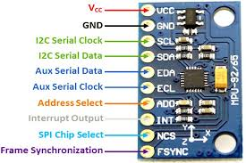

- **ESP32 Lite**            hoặc                    **ESP32**

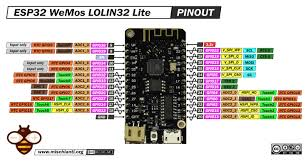 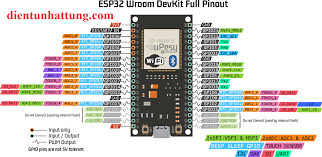

- **Rotary Encoder**

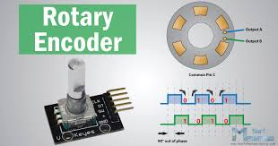

- **LCD**

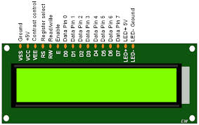

### Mã ví dụ:
```cpp
#include <MPU9250.h>
#include <Wire.h>
#include <BluetoothSerial.h>

MPU9250 mpu;
BluetoothSerial SerialBT;

void setup() {
  Serial.begin(115200);
  SerialBT.begin("Fishing_Rod"); // Tên Bluetooth
  Wire.begin();
  if (!mpu.begin()) {
    Serial.println("Không thể kết nối với MPU9250");
  }
}

void loop() {
  mpu.update();
  float angle = mpu.getAngleX();
  SerialBT.print("Góc X: ");
  SerialBT.println(angle);
  delay(100);
}
```
## Mô phỏng trên Wokwi
Wokwi là một nền tảng trực tuyến giúp bạn mô phỏng các dự án điện tử và lập trình nhúng. Nó hỗ trợ nhiều loại vi điều khiển như Arduino, ESP32, và các module cảm biến, LCD, bộ mã hóa quay (rotary encoder), cùng nhiều linh kiện khác. Điểm đặc biệt của Wokwi là bạn có thể lập trình trực tiếp trên trình duyệt mà không cần phần cứng thật.

Ngoài ra, nền tảng này cho phép mô phỏng thời gian thực và tương tác với các linh kiện để thử nghiệm và kiểm tra mã mà không cần cài đặt phần mềm hoặc kết nối các mạch vật lý. Điều này rất hữu ích cho việc học lập trình nhúng, phát triển và thử nghiệm các dự án mà không lo hư hỏng phần cứng hoặc gặp khó khăn trong việc thiết lập mạch.

Dự án tren được mô phỏng trên wokwi [Joystick cần câu cá](https://wokwi.com/projects/413630298524733441) 

### **Hình ảnh sơ đồ kết nối các linh kiện**
Khi khởi chạy chương trình
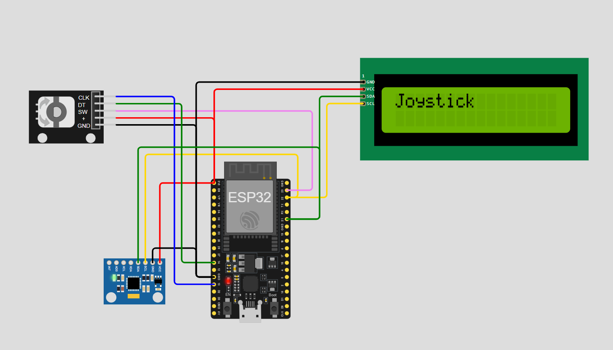

Sau khi có sự thay đổi sẽ lần lượt hiển thị các thông số

Rotary Encoder
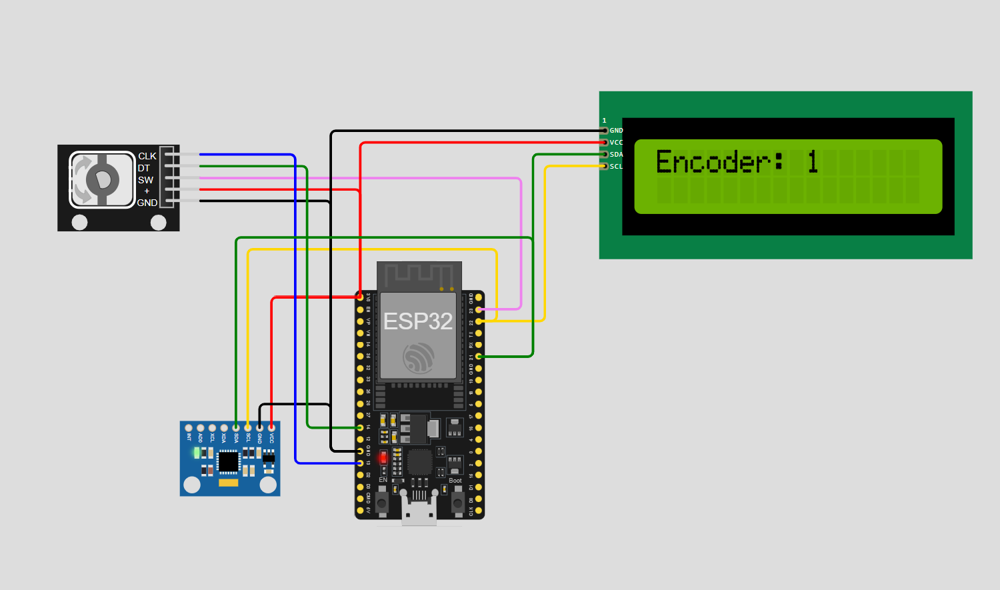

Cảm biến gia tốc
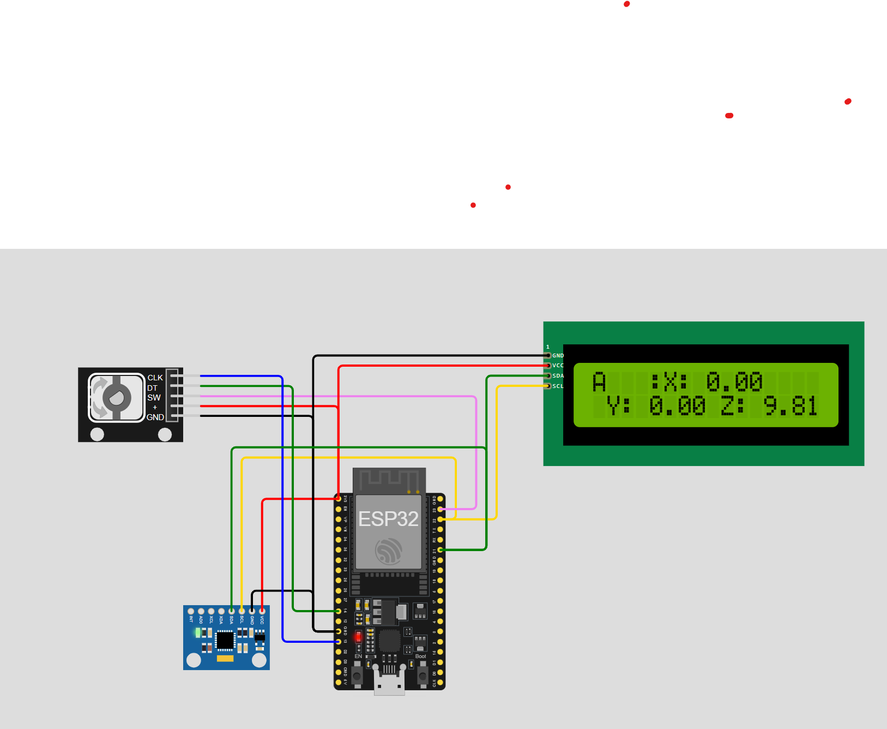

Cảm biến con quay hồi chuyển
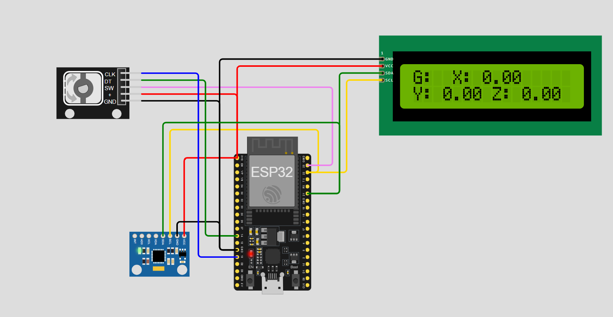

Cảm biến đo nhiệt độ
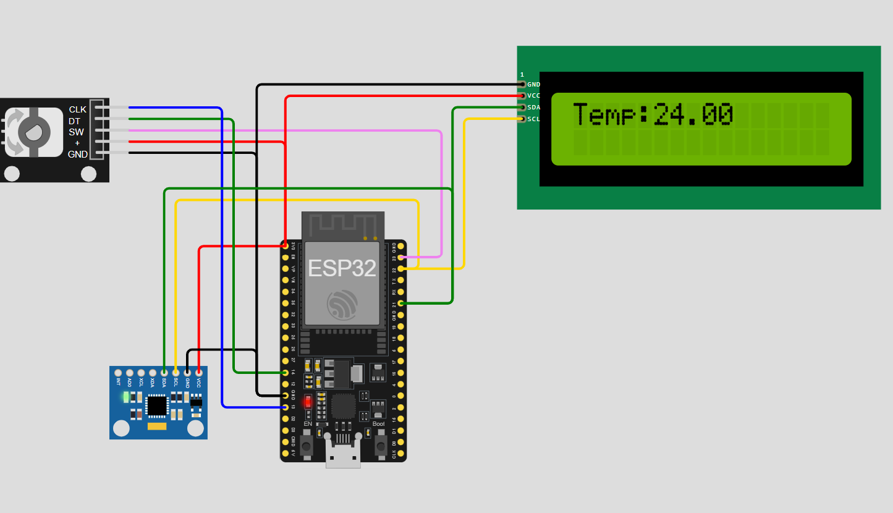

## Mô phỏng thực tế
Mô phỏng thiết bị cầm tay
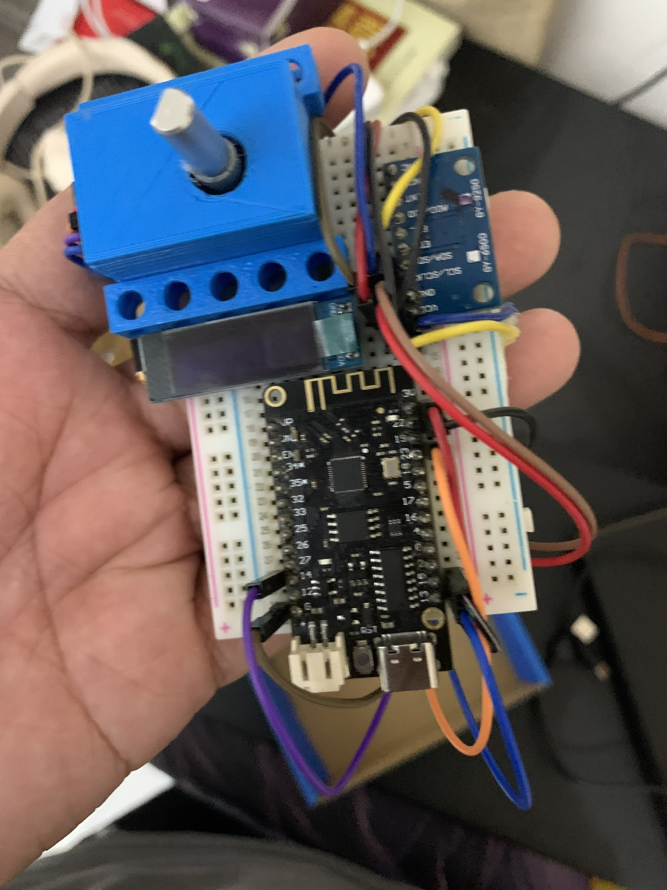

Mô phỏng khi gắn lên trên cần câu cá
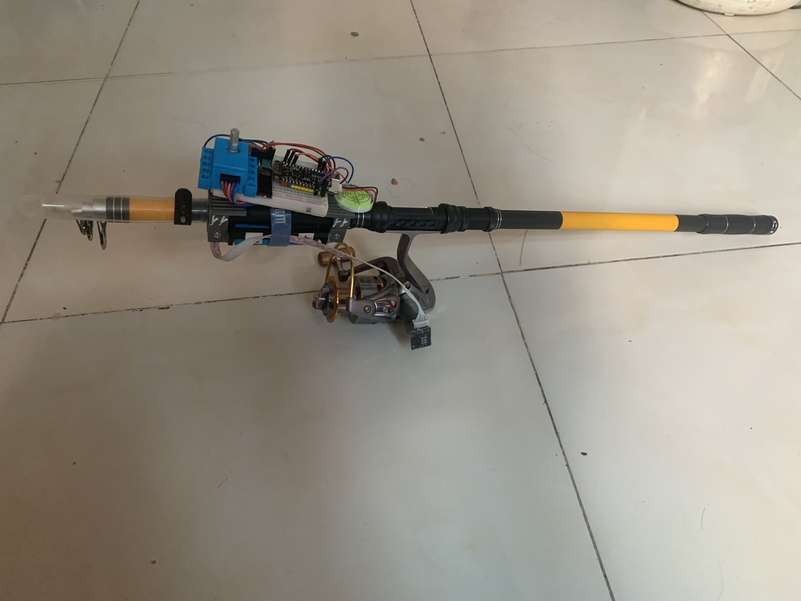
